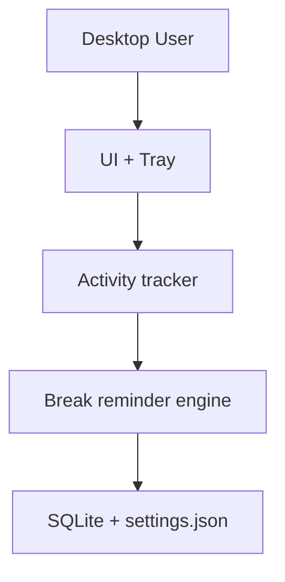
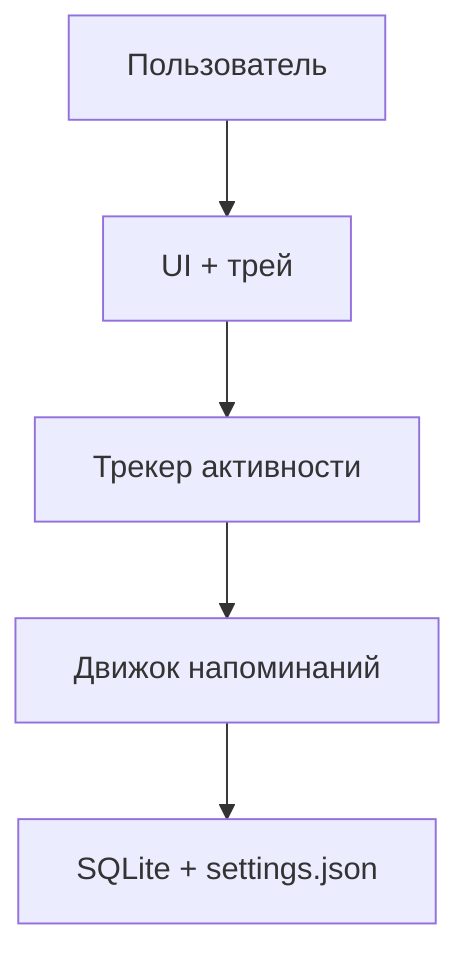

# ControlWork
[](https://github.com/DenisArger/ControlWork/actions/workflows/ci.yml)

## English
## Problem
Long uninterrupted computer sessions reduce productivity and health; users need reliable break reminders and active-time tracking.
## Solution
ControlWork is a desktop work-time tracker with tray controls, idle-aware accounting, and break enforcement modes.
## Tech Stack
- Python
- PySide6
- SQLite
- pytest
## Architecture
```text
src/controlwork/
tests/
pyproject.toml
scripts/
```

## Features
- Active-time tracking (idle excluded)
- Soft/hard break reminders
- Tray-based control flow
- Local settings + DB persistence
- RU/EN UI support
## How to Run
```bash
python3 -m venv .venv
source .venv/bin/activate
pip install -e .[dev]
python -m controlwork.main
```

## Русский
## Проблема
Долгая непрерывная работа за компьютером снижает продуктивность и вредит здоровью; нужен надежный учет времени и напоминания о перерывах.
## Решение
ControlWork — desktop-приложение с треем, учетом только активного времени и мягкими/строгими режимами перерыва.
## Стек
- Python
- PySide6
- SQLite
- pytest
## Архитектура
```text
src/controlwork/
tests/
pyproject.toml
scripts/
```

## Возможности
- Учет только активного времени
- Мягкие и строгие напоминания о перерыве
- Управление через трей
- Локальное хранение настроек и данных
- Интерфейс RU/EN
## Как запустить
```bash
python3 -m venv .venv
source .venv/bin/activate
pip install -e .[dev]
python -m controlwork.main
```
